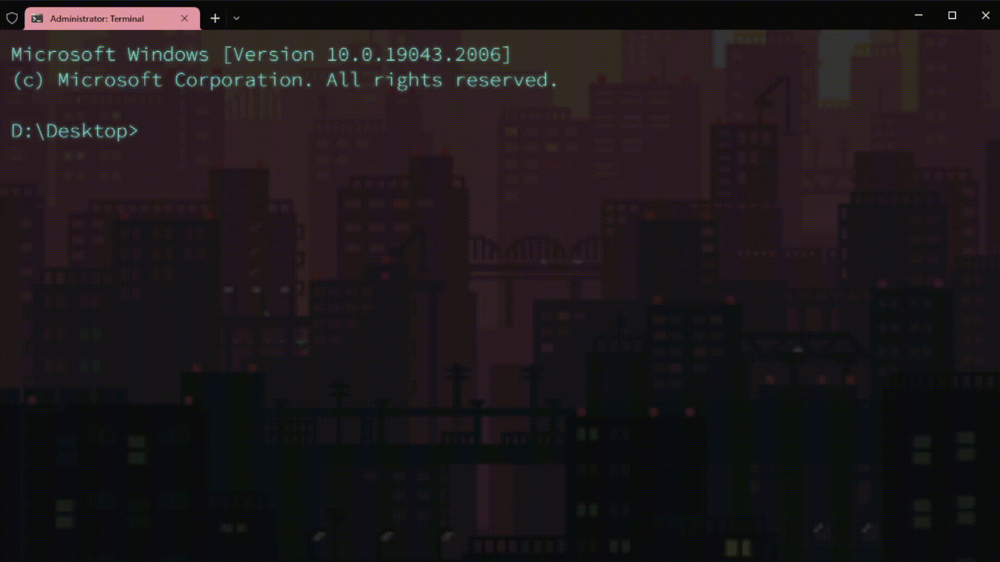
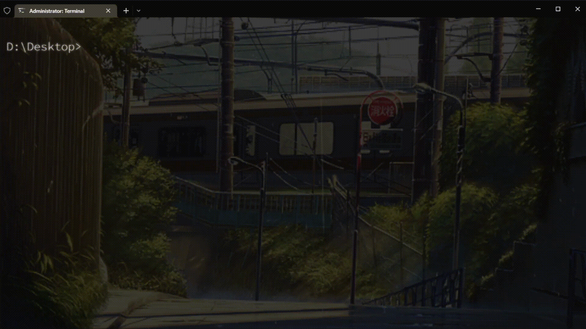

# Terminal_Randomizer
A script that changes the appearance of Windows Terminal: it picks a random background GIF/image and derives matching background, text, cursor, selection and tab colours from it.


## Example

<p align="center">
    
    
</p>


## How to Use

1. Install Windows Terminal (Microsoft Store or winget) and Python 3.8+.

2. Download this repository anywhere you like. No paths need editing.

3. Install the one dependency:
```
pip install -r requirements.txt
```

4. Run it from any folder:
```
python path\to\Terminal_Randomizer\src\terminal_randomizer.py
```
or just double-click `WinTerminal_Run.bat`, which runs the script and then opens Terminal.

The first run analyses every image (a few seconds) and saves a copy of your original settings to `input_files\settings_backup.json`. Later runs only analyse new or changed images.

To add your own backgrounds, copy them into the `photos` folder (`.gif`, `.png`, `.jpg`, `.jpeg`, `.bmp`).


## Options

| Option | What it does |
| --- | --- |
| `--profile NAME` | Only theme this profile (repeatable). By default all profiles are themed via `profiles.defaults`. |
| `--settings PATH` | Use this `settings.json` instead of auto-detecting it (or set the `WT_SETTINGS_PATH` environment variable). |
| `--photos DIR` | Use a different image folder. |
| `--shader` | Turn on the retro CRT shader (`input_files\Retro.hlsl`). It is off by default. |
| `--font-colors` | Pick the text colour from `input_files\font_colors.txt` instead of the image. |
| `--complementary` | Use the complementary hue of the image for text (closer to the original look). |
| `--clean-overrides` | Remove theme colours/backgrounds set directly on individual profiles, so they follow the random theme. |
| `--rebuild-cache` | Re-analyse all images. |
| `--dry-run` | Show what would change without writing anything. |
| `--restore` | Put back the settings backed up on the first run. |

To use options every time you launch through `WinTerminal_Run.bat`, add them to the line that runs the script. For example, to always turn on the retro shader, change:
```
%PY% "%~dp0src\terminal_randomizer.py" %*
```
to:
```
%PY% "%~dp0src\terminal_randomizer.py" --shader %*
```

The `settings.json` is found automatically for the Store (stable, Preview, Canary) and unpackaged (Scoop, Chocolatey, portable) installs. If yours lives elsewhere, open Terminal, go to Settings, click **Open JSON file**, and pass that path with `--settings`.

Note: the script rewrites `settings.json`, so any `//` comments in it are dropped (the backup keeps them).


## Font

I use Source Code Pro, which I recommend for legibility. It is free on Google Fonts: https://fonts.google.com/specimen/Source+Code+Pro. To use it, open your `settings.json` and add this under `profiles` → `defaults`:
```
"font": {
    "face": "Source Code Pro",
    "size": 20,
    "weight": "light"
},
```


## How do I make it go brr every time I open the terminal?

1. Right-click `WinTerminal_Run.bat` → **Show more options** → **Send to** → **Desktop (create shortcut)**.
2. Right-click the new shortcut → **Properties**, set **Run** to **Minimized** so the console window doesn't flash, and optionally click **Change Icon** to pick `input_files\terminal.ico`.
3. Pin the shortcut to Start or the taskbar and use it instead of the normal Terminal icon.

If you want Terminal to open as administrator, you can still use the Task Scheduler route instead: create a task with **Run with highest privileges** whose action starts `WinTerminal_Run.bat`, then make a shortcut to `C:\Windows\System32\schtasks.exe /RUN /TN "YourTaskName"`.
